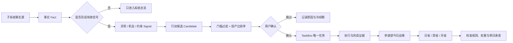

# 人生参谋部主动作与子系统闭环强化方案 V2

## 0. 文档边界

本方案把“已完成主动作仍在首页”和“主动作应该始终是投产比最高的任务”放进主参谋面板的完整系统闭环中统一设计。

本文同时记录产品规则与实际实施状态。P0-P4 已生产运行；P5-P6 只修改 HQ 前端派生模型、周期读取和周省兼容解析，不新增生产数据库字段，也不修改其他子系统事实。

## 1. 强化后的核心判断

人生参谋部不是任务首页，也不是子系统页面收藏夹，而是整个个人系统的判断层：

```text
子系统产生事实
→ 参谋部识别异常、机会与约束
→ 形成可解释的行动候选
→ 用户确认最高投产比动作
→ TaskBox 执行并保存证据
→ 结果回流参谋部
→ 日省 / 周省 / 月省校准下一轮行动与规则
```

因此，“今日唯一主动作”不能只是 `primaryTaskId` 对应的一张固定任务卡，而应是这个闭环在当下的唯一行动出口。

强化版的一句话原则是：

> 首页行动席位只展示当前尚未完成、真实可执行、来源可追溯、投产比最高且已经确认的行动；完成事项进入战果，异常与建议先成为候选，只有确认后才进入 TaskBox。

## 2. 两个问题其实是同一个架构问题

### 2.1 表面问题

盒子任务完成后，参谋部仍可能显示旧主动作。

### 2.2 深层问题

当前主动作同时承担了三种互相冲突的角色：

1. 当天最初承诺的历史记录。
2. 此刻正在执行的任务。
3. 系统推荐的下一件高价值行动。

这三个角色如果只靠一个 `primaryTaskId` 表达，就会出现：

- 完成后为了保留承诺记录而继续显示旧任务。
- 为了给出下一步而覆盖原始承诺，破坏日省统计。
- 子系统异常直接变成任务，制造噪音和重复记录。
- 云端旧快照覆盖本地完成事实，使任务“复活”。

强化版必须同时拆开“事实、候选、承诺、执行、战果”五种对象。

## 3. 五类对象与唯一事实源

| 对象 | 含义 | 唯一事实源 | 是否直接出现在主动作位 |
| --- | --- | --- | --- |
| 事实 `Fact` | 子系统产生的原始状态或结果 | 对应子系统 | 否 |
| 信号 `Signal` | 值得关注的异常、机会或变化 | 参谋部派生层 | 否 |
| 行动候选 `ActionCandidate` | 对信号或项目下一步的可执行建议 | 参谋部 | 仅候选区 |
| 执行任务 `Task` | 用户已确认、实际执行的动作 | TaskBox | 满足条件时可以 |
| 战果 `Outcome/Evidence` | 完成事实、回执、链接和外部结果 | TaskBox + 原业务系统 | 进入战果区 |

核心约束：

- 子系统事实不能因为进入参谋部而复制成第二套业务数据。
- 信号不能自动等于任务。
- 候选未确认前不能写入 TaskBox。
- TaskBox 完成记录不能被参谋部旧快照改回进行中。
- 战果不继续占据行动位，但必须保留可追溯入口。

## 4. 三个主动作概念

| 概念 | 产品含义 | 生命周期 | 数据用途 |
| --- | --- | --- | --- |
| 今日战略承诺 | 日省或用户为今天确定的第一关键结果 | 当日固定 | 承诺命中率、日省闭环 |
| 当前行动席位 | 此刻真正应该进入执行的唯一动作 | 可以随完成而变化 | 首页导航、跨面板深链 |
| 下一最佳候选 | 原动作完成后，按投产比选出的备选动作 | 用户确认前有效 | 推荐与取舍 |

推荐文案也应随状态变化：

- 原始承诺未完成：`今日战略主动作`
- 原始承诺已完成：`当前最高杠杆动作`
- 尚未确认接棒：`下一最佳候选`

这样既保留“今天只承诺一个关键结果”的纪律，也确保行动席位始终指向当前最高投产比的工作。

## 5. 统一闭环



真正的打通验收不是“页面能打开”，而是选一条真实事项跑通：

```text
发现 → 判断 → 确认 → 执行 → 证据 → 复盘 → 规则校准
```

整个过程中不需要人工复制粘贴，也不会重复生成任务或让已完成任务复活。

## 6. 首页信息架构

### 6.1 第一层：30 秒驾驶舱

只展示四件事：

1. 当前唯一行动席位。
2. 最多两个维护动作。
3. 当前最严重的系统异常。
4. 当前最需要用户作出的一个决策。

第一层不展示完整项目清单、系统指标瀑布或所有通知。

### 6.2 第二层：态势与候选

- 下一最佳动作候选，最多三个。
- 今日战果与完成回执。
- 项目健康和唯一瓶颈。
- 子系统健康、最后同步时间和最高级异常。
- 待决策队列。

### 6.3 第三层：原系统详情

通过深链进入 TaskBox、交易、健康、飞书或其他原系统。人生参谋部只携带来源、角色和返回路径，不重复建设专业操作界面。

## 7. 主动作席位的状态设计

### 7.1 承诺进行中

```text
今日战略主动作
发布人生参谋部 MVP

投产比 86 · 预计 60 分钟
本周唯一实验 / 可产生外部结果 / 当前无阻塞

[进入行动]
```

### 7.2 刚刚完成

任务在 TaskBox 完成后，本地立即退出行动席位，不等待云端响应：

```text
✓ 今日战略主动作已完成
发布人生参谋部 MVP · 14:32
[查看回执]
```

该内容进入“今日战果”，同时保留原始承诺 ID 和完成证据。

### 7.3 等待确认接棒

```text
下一最佳候选
完善用户反馈收集入口

投产比 79 · 预计 40 分钟
承接刚完成的发布 / 今天可以获得真实反馈
来源：项目中心 · 人生参谋部

[设为当前动作] [查看其他候选] [今天到此为止]
```

确认前它只是候选，不占用 TaskBox 任务名额；如果它已经是 TaskBox 中的任务，则只建立引用，不创建副本。

### 7.4 当前最高杠杆动作

用户确认接棒后：

```text
当前最高杠杆动作
完善用户反馈收集入口

今日原始承诺已完成 · 接棒动作 1
[进入行动]
```

接棒动作不能改写当天原始承诺命中率。

### 7.5 无合格候选

```text
今天的战略承诺已经闭环
当前没有达到行动门槛的高投产比事项。

[从盒子选择] [结束今日推进]
```

维护动作、普通提醒和低价值整理不会为了填满界面自动晋升。

### 7.6 数据未知

子系统读取失败时必须显示“数据未知 / 最后成功同步时间”，不能把未知误报为健康，也不能依据未知数据自动派发任务。

## 8. 投产比决策模型

投产比排序采用“先过门槛，再评分”，避免一个高价值但完全做不了的事项长期霸榜。

### 8.1 第一阶段：资格门槛

候选必须满足：

1. 未完成、未删除、未暂停、非模板。
2. 今天已经释放，当前确实可执行。
3. 来源事实仍然有效，没有被子系统撤销或解决。
4. 不属于已完成、暂停或放弃的项目。
5. 没有硬阻塞，或者候选本身就是解除阻塞的动作。
6. 有明确动作和完成标准，不是“关注一下”“看看情况”。
7. 有稳定 `sourceRef` 或 `syncKey`，可以追溯和去重。

### 8.2 第二阶段：MVP 评分

每个维度 0～5 分：

```text
基础得分 =
  结果价值 × 3
  + 战略相关 × 2
  + 杠杆效应 × 2
  + 时间窗口 × 1
  + 异常解除价值 × 1
  + 证据可信度 × 1
  - 执行成本 × 1
  - 切换成本 × 1
  - 风险与阻塞 × 3
```

最后换算为 0～100 的展示分。第一版建议候选门槛为 55 分。

### 8.3 评分含义

| 维度 | 低分 | 高分 |
| --- | --- | --- |
| 结果价值 | 内部整理、没有结果定义 | 发布、报价、成交、反馈或关键资产 |
| 战略相关 | 与月目标、本周实验无关 | 直接推动当前唯一实验或关键主线 |
| 杠杆效应 | 只完成一件小事 | 解锁多个任务、系统或可复用流程 |
| 时间窗口 | 可以长期延后 | 今天错过会产生明确损失 |
| 异常解除价值 | 普通状态波动 | 可解除系统级风险或关键瓶颈 |
| 证据可信度 | 数据过期或来源不明 | 事实源明确、刚同步且可验证 |
| 执行成本 | 短时间完成 | 时间、精力和协作成本很高 |
| 切换成本 | 与当前工作连续 | 需要切换设备、场景或认知领域 |
| 风险与阻塞 | 可逆、无依赖 | 不可逆、依赖缺失或结果高度不确定 |

### 8.4 投产比不只等于短期收入

人生参谋部中的“产出”至少包括：

- 现金与交易结果。
- 发布、报价、有效对话和真实反馈。
- 解除关键阻塞。
- 建立可重复使用的资产、流程和自动化。
- 降低重大风险。

系统建设任务只有在能明确减少搬运、提高闭环可靠性或解锁真实业务时才获得高杠杆分，避免“优化系统本身”无限占据主动作。

### 8.5 排序稳定性

同分时依次比较：

1. 战略相关。
2. 结果价值。
3. 时间窗口。
4. 数据可信度。
5. 预计完成时间更短。
6. 最近更新时间。

第一名和第二名分差小于 5 分时，界面并列展示给用户选择，不制造虚假的算法确定性。

## 9. 子系统接入契约

每个子系统在进入参谋部前填写统一接入卡：

| 字段 | 说明 |
| --- | --- |
| `systemId / name` | 稳定标识与名称 |
| `responsibility` | 该系统负责解释什么事实 |
| `factSource` | 正式事实数据源 |
| `readMethod` | API、文件、数据库或链接 |
| `writeMethod` | 允许写回的入口，没有则为空 |
| `openUrl` | 原系统深链 |
| `healthCheck` | 判断可用、异常和未知的方法 |
| `lastSyncAt` | 最后成功同步时间 |
| `freshnessSla` | 多久以后视为数据过期 |
| `actionTriggers` | 哪些状态才允许形成行动候选 |
| `evidenceReturn` | 完成后如何回写证据 |
| `owner` | 负责人或维护入口 |
| `accessLevel` | 入口、只读、受控写回 |

### 9.1 三级接入成熟度

| 等级 | 能力 | 约束 |
| --- | --- | --- |
| L0 入口 | 展示系统入口和说明 | 不宣称系统已打通 |
| L1 只读 | 读取健康、异常和最近结果 | 不修改原系统数据 |
| L2 受控写回 | 用户确认后写任务、决策或结果 | 必须幂等、可追溯、可重试 |

任何系统都先经过 L1 的真实价值验证，再考虑 L2。战略、交易、消费承诺和不可逆动作始终保留用户确认。

## 10. 行动候选统一数据结构

建议先以兼容 JSON 结构落地，不急于立即建完整新表：

```json
{
  "id": "candidate:<systemId>:<sourceId>:<actionKind>",
  "sourceSystemId": "SYSTEM",
  "sourceRef": "SOURCE_RECORD_ID",
  "sourceUpdatedAt": "2026-08-03T10:00:00Z",
  "kind": "risk|opportunity|project_next|decision_followup",
  "title": "可执行动作",
  "completionCriteria": "明确完成标准",
  "reason": "为什么现在值得做",
  "evidenceUrl": "SOURCE_DEEP_LINK",
  "suggestedBoxId": "BOX_ID",
  "mainlineId": "MAINLINE_ID",
  "estimatedMinutes": 40,
  "roiInputs": {
    "outcomeValue": 4,
    "strategicFit": 5,
    "leverage": 4,
    "timeWindow": 3,
    "anomalyRelief": 0,
    "confidence": 4,
    "effort": 2,
    "switchCost": 1,
    "riskBlock": 0
  },
  "score": 79,
  "status": "proposed|confirmed|dismissed|expired|converted",
  "dedupeKey": "SYSTEM:SOURCE_RECORD_ID:ACTION_KIND",
  "expiresAt": "2026-08-03T23:59:59Z"
}
```

### 10.1 去重规则

- 同一 `dedupeKey` 同一时刻只能存在一个活动候选。
- 候选确认时，先按 `taskId`、`syncKey`、来源和内容查找已有 TaskBox 任务。
- 已存在则建立引用并更新上下文，不创建副本。
- 来源事实已经解决时，候选变为 `expired`，不得继续推荐。
- 已完成 TaskBox 任务不能因候选刷新而重新创建。

### 10.2 噪音控制

同一系统的普通状态变化只更新系统总览。只有满足 `actionTriggers` 且超过门槛的变化才生成候选；同类信号在冷却期内合并，而不是连续生成通知和任务。

## 11. 数据所有权与写回矩阵

| 数据 | 主数据源 | 参谋部权限 | TaskBox 权限 |
| --- | --- | --- | --- |
| 任务、进度、完成状态 | TaskBox | 读取、引用、排序 | 创建与更新 |
| 完成回执 | TaskBox | 读取与汇总 | 写入 |
| 日省完整叙事 | Markdown / 飞书 | 读取摘要和链接 | 无 |
| 今日承诺结构 | 人生参谋部 | 写入与读取 | 读取角色 |
| 项目和里程碑 | 现有主线系统 | 读取健康、更新既有记录 | 关联任务 |
| 交易原始数据 | 交易系统 | 只读摘要与异常 | 无 |
| 健康原始数据 | 健康系统 | 只读摘要与异常 | 无 |
| 系统健康与接入配置 | `js/hq-systems.js`轻量`system_registry` | 读取与管理 | 无 |
| 行动候选 | 人生参谋部 | 生成、排序、关闭 | 确认后接收任务 |

## 12. 完成状态同步强化

现有前端和服务端都已过滤 `isCompleted=true`，当前回显更像记录级写入和 `/hq/today` 读取之间的竞态。修复遵循以下规则。

### 12.0 截至 2026-08-07 的实施结果

P0 核心保护已进入代码并通过完整自动化测试与生产构建：

- HQ 请求远端快照前等待当前记录级 API 变更队列完成。
- 远端承诺与最新本地任务按`updatedAt`合并；本地较新的完成或删除状态优先。
- 版本相同时，完成或删除事实优先，避免旧快照复活任务。
- 真正更新的远端“取消完成”版本仍可恢复任务，不把完成状态永久锁死。
- 每次 HQ 渲染使用递增版本号，并校验当前路由，过期异步响应不能覆盖新页面。
- 整库拉取在写入队列稳定后，把相同`id / syncKey / recurrenceKey`的云端记录视为权威版本；云端 tombstone 或替换不会再被旧浏览器时间戳压回，本地独有离线任务仍保留。
- 服务端已区分“省略`primaryTaskId`”与“显式传`null`”，后者可以真正清空主动作，并有集成测试覆盖。
- 记录级写入进入浏览器持久化 outbox；失败项跨重载保留，HQ 显示待同步，恢复连接后先重放，未成功前禁止整库快照覆盖本地完成事实。

真实云端 API 已通过完成、取消完成和跨来源删除/缓存收敛冒烟；跨域测试拓扑已通过弱网跨路由防覆盖，以及“离线完成 → 待同步 → 重载保持 → 重连重放 → 服务端完成”的完整闭环。服务端`null`清空修复已于 2026-08-07 发布：schema 与 HQ 集成测试、systemd active 检查、认证健康 200、未认证 401、生产 Origin 预检 204 均通过；线上发送`primaryTaskId: null`后读回为`null`，原 brief 随后恢复成功。P1 已于 2026-08-09 发布，“当前行动席位”和“今日战果”上线；线上 HQ 字段探针确认`primaryTaskId`与`currentActionTaskId`同时存在。

### 12.1 本地事实先行

1. 盒子本地写入完成状态、时间、回执和新 `updatedAt`。
2. 发布本地 `task-completed` 事件，使 HQ 缓存失效。
3. 页面立即把任务移入今日战果。
4. 记录级 PATCH 在现有任务队列中串行提交。
5. 同步状态单独显示，不反转任务完成状态。

### 12.2 读取前等待当前写入

从盒子进入参谋部或手动刷新 HQ 时：

- 等待当前任务的变更队列完成或进入明确失败状态。
- 再请求 `/hq/today`。
- 请求期间保留本地快照，不出现旧任务回闪。

### 12.3 按记录版本合并

```text
local.updatedAt > remote.updatedAt  → 本地优先
remote.updatedAt > local.updatedAt  → 云端优先
版本相同且一方为完成            → 完成优先
用户后来取消完成且版本更新        → 新版本优先
```

### 12.4 渲染防线

行动席位渲染前最后验证：

- 未完成。
- 未删除。
- 当前可见。
- 所属项目仍有效。
- 来源候选仍未过期。

## 13. 日省、周省、月省闭环

### 13.1 日省

日省读取：

- 今日原始战略承诺。
- 当前行动和接棒记录。
- TaskBox 完成证据。
- 今日战果与外部结果。
- 被跳过候选和原因。
- 子系统最严重异常与数据未知项。

日省写回：

- 次日唯一战略承诺。
- 最多两个维护动作。
- 需要升级的决策。
- 对错误候选或权重的校准意见。

### 13.2 周省

周省关注：

- 本周最高投产比动作投入比例。
- 推荐、确认、完成和产生外部结果的转化链。
- 高分但连续未执行的原因。
- 反复出现的系统异常是否真正进入决策或被解决。
- 哪些系统接入减少了人工搬运。

### 13.3 月省

月省关注：

- 哪类行动持续产生收入、发布、反馈、资产或风险下降。
- 哪条主线实际获得了时间资源。
- 是否出现“系统建设替代现实执行”。
- 哪些候选规则应沉淀为固定流程或自动化。
- 哪些低价值系统接入应该降级或停用。

## 14. 子系统接入优先级

### 第一批：闭环正确性

- 人生参谋部。
- TaskBox。
- 日省。
- 主线、支线和里程碑。

此阶段不增加系统数量，专门验证：

- 完成任务不回显、不复活。
- 日省确认任务只写入一次。
- 主动作、维护动作和普通任务不混淆。
- 完成证据进入下一次日省事实包。
- 候选确认后复用既有任务。

### 第二批：只读信号试点

从交易、镜像、GAP 教练、健康、飞书同步和 GitHub 部署状态中，按以下公式只选第一名试点：

```text
接入优先级 = 预期决策价值 × 使用频率 × 数据可靠性 - 接入成本 - 噪音风险
```

试点只读取状态、异常和最近结果，不反向修改原系统。

### 第三批：受控写回

一个只读接入连续使用两周、确实减少人工搬运并形成有效动作后，才开放：

- 用户确认后写入 TaskBox。
- 异常进入待决策队列。
- 完成摘要、文件路径或链接回流参谋部。
- 明确原则写回对应系统。

## 15. 分期实施方案

### P0：完成状态正确性（已完成）

- 修复 TaskBox 完成写入与 HQ 读取竞态。
- 增加记录版本合并和渲染防线。
- 增加待同步 / 数据未知状态。

验收：快速切换、弱网、离线、刷新和跨设备情况下，已完成任务都不会重新占据行动席位。

2026-08-05 验证结果：自动测试覆盖旧快照、本地较新完成/删除、同版本完成优先、远端较新取消完成、云端删除压过未来时间戳旧缓存、相同`syncKey`替换、`primaryTaskId: null`清空，以及离线 outbox 持久化/阻止覆盖/重放清空；完整`npm test`通过，生产构建 Build ID 为`c9d4495f22ca`。真实 API 与跨域弱网/离线 UI 闭环也已通过。

2026-08-07 生产收尾：通过临时 GitHub 托管 Runner 发布服务端修复，服务器恢复点为`/opt/taskbox-api/backups/p0-null-clear-20260807T060141Z`。发布后线上显式清空、读回和原 brief 恢复探针通过；一次性 Secret 与临时分支均已删除。

### P1：行动席位与战果分离

- 固化今日原始战略承诺。
- 引入当前行动语义。
- 增加今日战果和回执入口。
- 设计完成后的候选空状态。

验收：用户能清楚回答“今天承诺了什么、完成了什么、现在做什么”。

### P2：候选与投产比引擎

- 建立资格门槛、规则评分和可解释理由。
- 输出最多三个候选。
- 支持确认、跳过、冷却和手动选择。
- 确认后幂等复用或创建 TaskBox 任务。

验收：原主动作完成后，用户最多两次点击进入下一件高投产比行动，且不会生成重复任务。

2026-08-09 生产发布：已实现现有 TaskBox 任务的资格过滤、九维规则评分、55 分门槛、最多三项稳定排序、四小时跳过冷却、人工选择和确认接棒。主线系统的`blocked / needs_action`事实成为首个原生`ActionCandidate`输入；确认时先按任务 ID、`candidateDedupeKey`和`hq-candidate:<dedupeKey>`查重，不存在才在重要盒创建一条关联原主线的任务。真实浏览器通过“原始承诺完成→战果→候选跳过→新候选排序→确认接棒”和“无下一步主线→原生候选→双击确认→仅一条任务→项目恢复健康”；390px/1440px 无横向溢出或控制台错误。缓存部分更新保留原始承诺，显式`primaryTaskId: null`仍是唯一完整清空语义。专项、全量、API 幂等测试均通过；Pages 工作流`31292056719`成功发布 Build ID `a485fa88a115`，生产分块包含候选 syncKey、去重键、主线信号和当前行动字段，API 认证健康`200`、未认证`401`、生产来源预检`204`且服务保持 active。

### P3：统一子系统接入卡

- 先用配置文件或兼容 JSON 建立轻量 registry。
- 为现役系统填写职责、事实源、健康检查、写回权限和异常触发。
- 只选择一个 L1 系统跑真实事项闭环。

验收：该事项无需复制粘贴，完整跑通发现、判断、执行、证据和复盘。

2026-08-09 生产发布：`js/hq-systems.js`已登记日省、主线、TaskBox、交易、镜像和 GAP 六张接入卡，覆盖职责、事实源、读写方式、健康检查、同步 SLA、触发门槛、证据回流、负责人及 L0/L1/L2 成熟度。主线系统成为首个 L1 只读系统：自动消费现有 HQ 项目快照，不修改主线原数据；读取失败/本地快照显示未知，超过十分钟显示过期，只有`blocked / needs_action`计入行动信号，并与 P2 生成的主线候选数量做自动一致性测试。TaskBox 和日省沿用既有 L2 用户确认链路，其他系统保持 L0，不宣称已打通。接入卡详情展示当前最高信号与“发现→判断→执行→证据→复盘”状态；专项/全量测试、生产构建、390px/1440px 无溢出、移动详情布局、界面跳转和控制台验收通过。Pages 工作流`31302177865`首轮因上一版部署锁失败，attempt 2 成功发布 Build ID`dca5c12098ba`；入口`assets/app-VLRUGPBP.js`、样式`assets/style-VA4J23EG.css`及生产分块中的接入契约、L1、门槛、闭环和未知状态标识均已核对。P3 未修改 API 运行代码或数据库 schema；现有 API 未认证健康`401`、生产 Origin 预检`204`。

### P4：复盘校准与受控写回

- 日省产生`daily_action_proposal`，周省产生`weekly_experiment_proposal`，月省产生`monthly_bet_proposal`。
- 授权来源分为`explicit_user / standing_rule / ai_derived`；AI 推导默认停在`proposed`，不能绕过审批。
- proposal 使用稳定幂等键和 revision，状态为`proposed / approved / rejected / deferred / promoted`，每次转换写审计事件。
- 只有批准的日动作允许晋升 TaskBox；周实验和月押注保持战略对象，临时证据月押注禁止批准。
- 晋升同时要求请求`shadowMode=false`与服务端`HQ_PROPOSAL_PROMOTION_ENABLED=1`，关闭任一侧即保持 shadow mode。

验收：接入连续两周减少人工搬运，同时没有增加重复任务和无效通知。

2026-08-10 生产发布：前端 REVIEW CALIBRATION 控制面、三类 proposal、五态状态机、授权来源、revision、幂等键与审计轨迹均已上线。Pages 工作流`31324155726`发布 Build ID`1962464071d3`，入口`assets/app-AEO5YO7V.js`、样式`assets/style-KKWZZMR4.css`、P4 分块`assets/chunk-XDQ4ZDYX.js`。API schema 新增`hq_proposals`与`hq_proposal_events`；schema、HQ、proposal 专项测试通过。生产探针通过认证`200`、未认证`401`、CORS`204`和 proposal 队列`200`，周实验完整记录`created → approve → defer → reject`，战略晋升返回`409`且没有创建任务。当前 API 回滚点为`/opt/taskbox-api/backups/p4-review-proposals-20260809T170701Z`。

### P5：资源配置驾驶舱

- 当前行动上方只展示一个已批准月度押注，包含成功标准、瓶颈、杀死条件与下一次验证时间。
- 项目中心展示计划投入、实际投入、外部结果和资源判断；缺失数据保持未知。
- 周省通过可选治理指标记录系统维护耗时、有效决策、外部结果、重复录入和信号到行动中位时间。

### P6：两周治理门

- 连续观测至少14天且五项指标齐全后，才形成保留、简化或停止建议。
- 建议只读，不评价个人绩效，不自动删除功能、修改子系统或派发TaskBox任务。
- `observationDays`可由周省覆盖天数机械映射，其余指标只接受明确数值，不从自然语言推断。

2026-08-23 生产发布：新增`js/hq-resource-governance.js`及专项测试，周期缓存同时刷新周/月省；周省解析器保留`metrics.rows`并增加六个可选治理字段。PR #12 合并提交`4237b97`，Pages工作流`32634346744`发布Build ID`8956dbc8f134`；全量测试、周期桥接、线上分块及1440px/390×844验收通过，无横向溢出或控制台错误。

## 16. 验收清单

### 16.1 主动作

- [x] 完成操作后立即退出行动席位。
- [x] 完成事项进入今日战果并保留回执。
- [x] 原始承诺不被接棒动作覆盖。
- [x] 下一候选必须确认后才成为当前行动。
- [x] 普通维护任务不会自动晋升。
- [x] 无候选时不为了填满页面推荐低价值任务。

### 16.2 数据与同步

- [x] 快速跨面板切换不出现旧任务回闪。
- [x] 云端旧快照不能覆盖本地新完成状态。
- [x] 离线完成保持有效并显示待同步。
- [x] 主动取消完成以更新版本正常恢复任务。
- [x] 同一来源事项重复同步不会创建副本。
- [x] 来源已经解决的候选会过期，不继续推荐。

### 16.3 投产比

- [x] 每个候选有来源、完成标准、分数和推荐理由。
- [x] 已完成、删除、暂停、未释放、硬阻塞任务被过滤。
- [x] 数据过期或来源未知会降低可信度或取消资格。
- [x] 同分排序稳定，接近同分时交给用户选择。
- [x] 系统建设任务必须说明现实收益才获得高分。

### 16.4 子系统接入

- [x] 每个系统都有唯一事实源和接入等级。
- [x] L0、L1、L2 状态在界面上可区分。
- [x] 未验证的系统没有自动写回能力。
- [x] 数据读取失败显示未知，不误报正常。
- [x] 只有越过行动门槛的信号才形成候选。
- [x] 主线事项链路已覆盖发现、判断、确认执行、完成证据与日省复盘，并由纯模型集成测试验证。

### 16.5 日周月复盘

- [ ] 日省区分原始承诺与接棒动作。
- [ ] 周省可以解释高分候选未执行的原因。
- [ ] 月省可以识别系统建设是否挤压现实产出。
- [ ] 评分权重能够根据真实结果被校准。

## 17. 观测指标

第一阶段只保留能验证闭环价值的指标：

1. 已完成任务回显次数：目标 0。
2. 重复任务创建次数：目标 0。
3. 从完成主动作到确认下一行动的中位时间。
4. 候选确认率、跳过率和手动替换率。
5. 确认候选最终完成并产生外部结果的比例。
6. 子系统事项需要人工复制粘贴的次数。
7. 数据未知被误报为健康的次数：目标 0。

## 18. 风险与护栏

### 风险一：把参谋部做成更漂亮的任务列表

护栏：事实先成为信号和候选，确认后才进入 TaskBox；参谋部保留判断职责。

### 风险二：最高分绑架用户

护栏：分数必须可解释；接近同分让用户选择；支持跳过、冷却和手动指定。

### 风险三：系统接入制造通知洪水

护栏：状态变化默认只更新总览；越过触发阈值才形成候选；同类信号合并。

### 风险四：多个事实源互相覆盖

护栏：每个字段声明唯一事实源；参谋部保存引用、摘要和判断，不复制完整原始数据。

### 风险五：系统建设替代现实执行

护栏：每次只接一个系统并绑定真实事项；闭环未跑通前不扩展；系统任务必须证明外部结果或明确节省。

### 风险六：完成任务被旧数据复活

护栏：记录版本合并、本地完成事实先行、读取前等待写入、渲染层最终过滤。

## 19. 回滚策略

- P0 可独立发布和回滚，不依赖候选引擎。
- P1 新语义字段采用可选读取；功能关闭时仍可用现有 `primaryTaskId`。
- P2 评分失败时退回确定性规则：原承诺未完成则显示，完成后显示空状态和手动选择。
- P3 registry 初期使用轻量配置，移除单个接入不影响 TaskBox 与日省核心闭环。
- 回滚不得恢复“已完成任务继续占据行动席位”或“未知数据被显示为健康”的行为。

## 20. 实施前已确定的决策

1. 人生参谋部是判断层，TaskBox 是执行事实层。
2. 主动作席位是动态战略席位，不是固定任务展示位。
3. 今日原始承诺、当前行动和下一候选分开表达。
4. 已完成任务进入今日战果，立即退出行动席位。
5. 先过滤资格，再计算投产比。
6. 子系统异常先形成信号和候选，用户确认后才进入 TaskBox。
7. 同一事项全链路保留稳定来源和去重键。
8. 第一阶段先修数据正确性，再做候选推荐，最后接入新系统。

## 21. 下一次执行入口

P0-P6 已生产运行并通过线上核对。下一步连续观测至少14天，再根据真实周省指标决定保留、简化或停止；在样本未满前不扩展自动化。P5-P6没有API/schema发布；如未来要改变其他子系统字段或写回能力，先通过`AGENTS.md`登记的既有任务核对边界。
